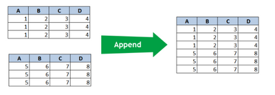
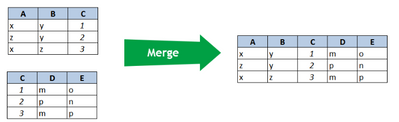

# APP A: Introduction to Programming
## Session 12

|Session Time|Facilitator|Starting URL                                                               |
|------------|-----------|---------------------------------------------------------------------------|
|1 Hour      |GR         | |

## Last Week's Challenge - Extend

## Troubleshooting & Debugging - Tips & Tricks
- The print() function.
- Run your code as you make incremental changes.
- Run code that already works, and slowly modify.
- Pay attention to the error message!
- Google the error message.
- Copy the program file and try different solutions.
- Comment out parts of the code you aren't troubleshooting.

> ``# Comment``

> ``''' Multiline Comment '''``

> ``exit()``


## JSON: Identifying Keys &/OR Values
```python
import json

person = {'ID': 1, 'First Name': 'Brad', 'Last Name': 'Brooks', 'Gender': 'Male', 'Age': 20, 'Email': 'b.brooks@randatmail.com'}
print('object:')
print(json.dumps(person, indent=4))

# Give me the keys
print("==================")
print('keys:')
for each in person.keys():
    print(each)
print("==================")

# Give me the values
print("==================")
print('values:')
for each in person.values():
    print(each)
print("==================")

# Give me the items as a tuple with 2 items
print("==================")
print('items:')
for each in person.items():
    key = each[0]
    value = each[1]
    print(each)
    print(f'{key=}') # key
    print(f'{value=}') # value
print("==================")
``` 


## Merging and Appending datasets

### Append
Appending datasets means that we are adding rows from one set of data, and adding those to another set with the same fields.



### Merge
Merging datasets means that we are adding columns from one set of data, and adding those to another set with the same id's.




## Challenge
Create a CSV file from employeesA.json and employeesB.json!